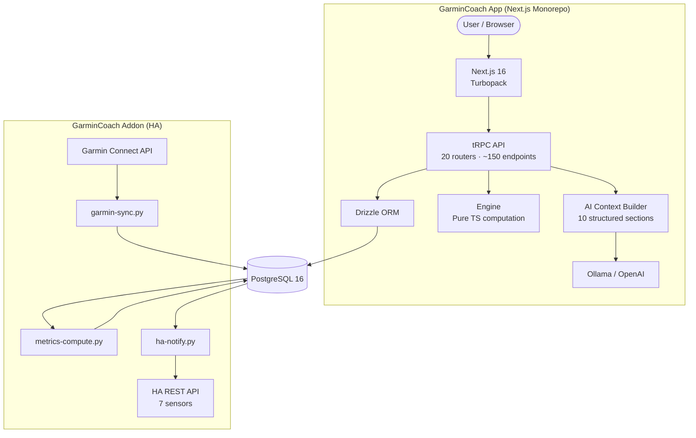

# GarminCoach — AI Fitness Coaching App

AI-powered sport scientist that turns Garmin data into actionable coaching,
training analysis, and recovery optimization.

## Architecture



## Tech Stack

- **Framework:** Next.js 16 (Turbopack)
- **Database:** PostgreSQL 16 + Drizzle ORM
- **API:** tRPC v11 with React Query
- **AI:** Ollama / OpenAI for coaching chat
- **Monorepo:** pnpm + Turborepo
- **UI:** Tailwind CSS v4 + shadcn/ui
- **Auth:** Better Auth

## Packages

| Package | Purpose |
|---------|---------|
| `apps/nextjs` | Next.js web application |
| `packages/api` | tRPC routers + AI context builder |
| `packages/db` | Drizzle schema + migrations (22 tables) |
| `packages/engine` | Pure TS computation (readiness, strain, baselines, anomalies, correlations) |
| `packages/garmin` | Garmin Connect API client |
| `packages/auth` | Better Auth configuration |
| `packages/validators` | Shared Zod schemas |
| `packages/ui` | shadcn/ui component library |

## Pages

| Route | Description |
|-------|-------------|
| `/` | Dashboard — readiness score, today's workout, recent activities |
| `/training` | PMC chart (CTL/ATL/TSB), ACWR gauge, risk zones |
| `/fitness` | VDOT, race predictions with confidence intervals |
| `/activities/[id]` | Activity detail — laps, efficiency, RPE, zone distribution |
| `/insights` | Proactive AI insight cards (6-rule engine) |
| `/journal` | Whoop-style daily check-in (body feel, inputs, cycle) |
| `/interventions` | Recovery intervention log with effectiveness ratings |
| `/sleep` | Sleep analysis, debt tracking, stage breakdown |
| `/trends` | 6+ year multi-metric overlay charts |
| `/coach` | AI coaching chat (sport scientist, psychologist, nutritionist, recovery) |
| `/power` | Critical power curve, power-duration chart |
| `/validation` | Reference measurement comparison |
| `/export` | CSV/JSON data export |
| `/team` | Multi-athlete profile switcher |
| `/correlations` | Metric correlation analysis |
| `/zones` | HR zone distribution + Seiler polarization |

## Database Schema (22 tables)

Key tables: `profile`, `daily_metric`, `activity`, `readiness_score`,
`journal_entry`, `session_report`, `intervention`, `advanced_metric`,
`athlete_baseline`, `ai_insight`, `correlation_result`, `race_prediction`,
`vo2max_estimate`, `training_status`, `weekly_plan`, `daily_workout`,
`workout_time_series`, `data_quality_log`, `reference_measurement`,
`audit_log`, `chat_message`, `post`.

## Engine Modules

| Module | Computes |
|--------|----------|
| `readiness` | Daily score (0–100) from HRV, sleep, load, RHR, stress via z-scores |
| `strain` | TRIMP-based training load with sex-specific constants |
| `baselines` | 30-day EMA + rolling SD for z-score transformations |
| `anomalies` | HRV crashes, sleep deficiency, overtraining signals |
| `vo2max` | ACSM / Uth / Cooper estimates + Riegel race predictions |
| `training-status` | Productive, maintaining, detraining, overreaching, peaking, recovery |
| `sleep-coach` | Debt tracking, extension recommendations |
| `correlations` | Pearson coefficients between metrics and journal tags |
| `trends` | Rolling averages (30/90/180/365d) + linear regression |
| `coaching` | Weekly plan generation from templates |
| `running-form` | Running form metrics and analysis |

## AI Context Pipeline

The AI coaching chat includes 10 structured context sections injected into
every prompt:

1. Athlete Profile (age, weight, sport, goals, thresholds)
2. Training Load (CTL / ATL / TSB / ACWR)
3. Recent Activities (last 7 days)
4. Zone Distribution (HR zones, polarization)
5. Sleep (stages, quality, debt)
6. Readiness & Recovery (score, confidence, contributing factors)
7. Journal (7-day history — body feel, inputs, cycle)
8. Interventions (recent 10 with effectiveness ratings)
9. Advanced Load Metrics (ramp rate, monotony, strain)
10. Personal Baselines (z-scores vs 30-day norms)

## Testing

- **239 tests** across 23 files (engine, API, Next.js unit + E2E)
- Engine: readiness, strain, baselines, anomalies, coaching, validation
- API: profile, readiness, trends, workout routers
- Next.js: PMC chart accuracy, export utils, athlete fixtures
- E2E: navigation, onboarding, settings, trends (Playwright)
- **CI:** GitHub Actions — lint + typecheck + Jest + E2E on every PR

## Development

```bash
# Prerequisites: Node 20+, pnpm 9+, Docker (for Postgres + Redis)

# Start backing services
docker compose up -d

# Install dependencies
pnpm install

# Push schema to database
pnpm db:push

# Start dev server
pnpm dev
```

## License

MIT
